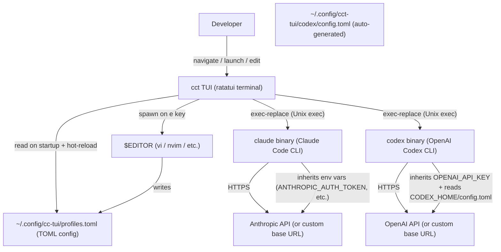

# cct — Architecture Document

<!-- BEGIN:architecture -->

## Project Overview

- **Problem Domain**: `cct` is a terminal UI launcher for Claude Code and OpenAI Codex. It lets users define named "profiles" (different model configs, API keys, extra flags) for both `claude` and `codex` CLIs in a single TOML file, and select them via an interactive ratatui TUI. Profiles are organized into two backend tabs (Claude / Codex), and the selected profile is launched via Unix exec-replace.
- **Primary Users**: Individual developers who run Claude Code locally across multiple configurations (e.g., different models, API providers, permission modes).

## Tech Stack

| Item | Value |
|------|-------|
| Language | Rust (edition 2021) |
| TUI Framework | ratatui 0.29 + crossterm 0.28 |
| Config Serialization | serde + toml 0.8 |
| Path Utilities | dirs 5 |
| Error Handling | anyhow 1 |
| Build Tool | Cargo |
| Runtime | Native Unix binary (no runtime, exec-replacement) |
| CI | GitHub Actions (lint + test on push/PR; release on tag) |

## Architecture Pattern

**Flat single-binary CLI with 5 focused modules** — no shared mutable global state. The architecture is closer to a classic Unix filter than to a server application:

```
Config (TOML) → App (cursor state + backend filter) → UI (ratatui draw loop) → Launch (exec-replace)
```

Each module has no circular dependency. `launch` dispatches to either `exec_claude` or `exec_codex` based on `profile.backend`. `ui` uses `app.filtered_indices()` to render only the profiles matching `app.active_backend`.

## Core Modules (First-level)

| Module | File | Responsibility |
|--------|------|----------------|
| `config` | `src/config.rs` | Deserialize `profiles.toml` via serde/toml; `Backend` enum; `validate_profiles`; write default config on first run; append/update profiles with backend-specific env generation; `toggle_skip_permissions`, `toggle_auth_type`, `toggle_full_auto` via toml_edit |
| `app` | `src/app.rs` | Cursor state (`selected`), `active_backend`, `filtered_indices()`, `switch_backend()`, `AppMode` (Normal/AddForm), `FormState` with `to_new_profile()` as single source of truth for field-index mapping |
| `ui` | `src/ui.rs` | ratatui rendering — tab bar + 35/65 split filtered list + detail/form panel + footer; `build_form_lines` uses `field_labels(backend)` dynamically; masks sensitive env vars |
| `launch` | `src/launch.rs` | `build_launch_command` dispatch; `exec_claude`/`exec_codex`; `generate_codex_config` writes `~/.config/cct-tui/codex/config.toml`; `exec()` process replacement; open `$EDITOR` |
| `cli` | `src/cli.rs` | `cct add` interactive CLI subcommand — 5 prompts, masked summary, duplicate guard; creates Claude profiles only |

## Critical Path

### Startup Flow
```
src/main.rs (entry point)
  → config::ensure_default_config()   # create ~/.config/cc-tui/profiles.toml if absent
  → launch::check_claude_installed()  # `which claude` — false if missing
      → [if missing] launch::prompt_install()
          → prompt "Install now? [Y/n]"
          → [Y] run `curl -fsSL https://claude.ai/install.sh | bash`
          → re-check PATH + ~/.local/bin fallback → exit 1 on unresolvable failure
  → config::load_profiles()           # parse TOML → Vec<Profile>
  → crossterm: enable_raw_mode + EnterAlternateScreen
  → App::new(profiles)                # initialize cursor at index 0, mode = Normal
  → loop:
      tui.draw(|f| ui::draw(&app, f)) # render list + detail/form + footer
      event::read()                    # block on keypress
```

### Main Use Case — Launch Claude Profile
```
User presses [Enter] (mode = Normal, active_backend = Claude)
  → launch::restore_terminal()        # disable raw mode, LeaveAlternateScreen
  → launch::exec_claude(&profile, with_continue=false)
      → env::set_var(k, v) for each profile.env entry
      → launch::build_args(profile, false) # --model, --dangerously-skip-permissions, extra_args
      → Command::new("claude").args(...).exec()  # Unix exec — process replaced, no return

User presses [c] (mode = Normal) — "Resume" / continue last session
  → launch::restore_terminal()
  → launch::exec_claude(&profile, true)    # with_continue=true
      → launch::build_args(profile, true)  # --continue first, then --model, skip-perms, extra_args
      → Command::new("claude").args(...).exec()
```

### Main Use Case — Launch Codex Profile
```
User presses [Enter] (mode = Normal, active_backend = Codex)
  → launch::restore_terminal()
  → launch::exec_codex(&profile)
      → check_codex_installed()       # `which codex` — error if not found
      → generate_codex_config(&profile, codex_home)
          → writes ~/.config/cct-tui/codex/config.toml with model, base_url, name
      → env::set_var("CODEX_HOME", codex_home)
      → env::set_var(k, v) for each profile.env entry (OPENAI_API_KEY)
      → launch::build_codex_args(profile)  # --full-auto, extra_args (no --model)
      → Command::new("codex").args(...).exec()  # Unix exec — process replaced
```

### Add Profile — TUI Form (key `a`)
```
User presses [a] (mode = Normal)
  → app.mode = AppMode::AddForm(FormState::new() with backend = active_backend)
  → TUI renders 5-field form:
      Claude: Name *, Description, Base URL, API Key, Model
      Codex:  Name *, Base URL, API Key, Model, Full Auto (y/n)
  → User fills fields (Tab/↑↓ navigate, Backspace edits)
  → User presses [Enter] on last field → form.confirming = true
  → TUI shows confirmation summary (API Key masked via mask_value)
  → User presses [y]
      → config::profile_name_exists(name) guard
      → form.to_new_profile()         # single source of truth for field-index mapping
      → config::append_profile(&new_profile)
          → Claude: writes [[profiles]] block + [profiles.env] (ANTHROPIC_* vars)
          → Codex: writes [[profiles]] block with base_url + full_auto fields + [profiles.env] (OPENAI_API_KEY only)
      → config::load_profiles()       # reload to pick up new profile
      → app.selected = index of new profile
      → app.mode = AppMode::Normal
```

### Add Profile — CLI (`cct add`)
```
cct add
  → cli::run_add()
      → 5 sequential prompts (name required, rest optional)
      → duplicate name check via config::profile_name_exists
      → masked summary display (API Key shown as "sk-1...key4")
      → Save? (y/n) confirmation
      → config::append_profile(&NewProfile { ... })
```

### Edit Config — CLI (`cct edit`)
```
cct edit
  → launch::open_editor(&config::config_path())
      → env::var("EDITOR").unwrap_or("vi")
      → Command::new(editor).arg(config_path).status()
      → blocks until editor exits
      → no TUI involved — runs before raw mode / alternate screen
```

### Toggle skip_permissions (key `s`)
```
User presses [s] (mode = Normal, profiles non-empty)
  → compute new_val = !profile.skip_permissions.unwrap_or(false)
  → config::toggle_skip_permissions(&profile.name, new_val)
      → parse TOML with toml_edit::DocumentMut (preserves comments)
      → set entry["skip_permissions"] = new_val
      → write file
  → [Ok] app.profiles[selected].skip_permissions = Some(new_val)
      → UI re-renders: row turns red (true) or normal (false)
  → [Err] eprintln warning; app state unchanged
```

### Toggle auth_type (key `t`)
```
User presses [t] (mode = Normal, profiles non-empty, backend = Claude)
  → config::toggle_auth_type(&profile.name)
      → parse TOML with toml_edit::DocumentMut
      → if auth_type == "token": rename ANTHROPIC_AUTH_TOKEN → ANTHROPIC_API_KEY, remove auth_type field
      → else: rename ANTHROPIC_API_KEY → ANTHROPIC_AUTH_TOKEN, set auth_type = "token"
      → write file (preserves comments)
  → config::load_profiles() to reload updated profile
  → app.profiles[app.selected] = reloaded profile
```

### Duplicate Profile (key `d`)
```
User presses [d] (mode = Normal, profiles non-empty)
  → FormState::from_profile(&selected)  # prefill all fields from source
  → form.is_edit = false                # ensure save uses append, not update
  → form.original_name = None
  → form.fields[0].push_str("_copy")    # append suffix to name
  → app.mode = AppMode::AddForm(form)
  → User can edit any field, then confirm with [y]
  → save_form → config::append_profile  # creates new profile, original unchanged
```

### Hot-reload Config (key `e`)
```
User presses [e]
  → launch::restore_terminal()
  → launch::open_editor(&config_path())   # blocks until $EDITOR exits
  → crossterm: re-enable raw mode
  → config::load_profiles()              # re-parse TOML in-place
  → update app.profiles + clamp cursor
```

## Configuration-Driven Logic

| Config Source | Effect |
|--------------|--------|
| `~/.config/cc-tui/profiles.toml` (default) | Main profile store; location overridable via `CCT_CONFIG` env var |
| `CCT_CONFIG` env var | Override config file path (used by integration tests) |
| `CCT_CLAUDE_BIN` env var | Override binary name used by `check_claude_installed` (used by unit tests to substitute `"true"` or a nonexistent binary) |
| `$EDITOR` env var | Editor opened on `e` key; falls back to `vi` |
| `profiles[].backend` | `"claude"` (default) or `"codex"` — determines which binary is exec'd |
| `profiles[].base_url` | First-class profile field. Claude: becomes `ANTHROPIC_BASE_URL` in env. Codex: written to `config.toml` via `generate_codex_config`. |
| `profiles[].full_auto = true` | Codex-only. Adds `--full-auto` to codex invocation. |
| `profiles[].model` | Claude: adds `--model <value>`. Codex: written to `config.toml` (not passed as CLI arg). |
| `profiles[].skip_permissions = true` | Claude-only. Adds `--dangerously-skip-permissions` to `claude` invocation. |
| `profiles[].auth_type = "token"` | Claude-only. Uses `ANTHROPIC_AUTH_TOKEN` env var instead of `ANTHROPIC_API_KEY`. Toggle via `t` key or `cct add --auth-type token`. |
| `profiles[].extra_args = [...]` | Appended verbatim after other flags |
| `profiles[].env.*` | Injected as process environment variables before exec |
| Add-flow `base_url` → `ANTHROPIC_BASE_URL` | Auto-written to `[profiles.env]` by `append_profile` |
| Add-flow `api_key` → `ANTHROPIC_API_KEY` | Auto-written to `[profiles.env]` by `append_profile` |
| Add-flow `model` → 5 model alias env vars + `API_TIMEOUT_MS` + `CLAUDE_CODE_DISABLE_NONESSENTIAL_TRAFFIC` | Auto-written to `[profiles.env]` by `append_profile` when model is non-empty |
| `CCT_LIVE_TESTS=1` | Enables the live E2E test suite (requires real `claude` binary) |
| `CCT_TEST_TOML` | Integration test: override config path for subprocess exec test |
| `CCT_TEST_ARGS_FILE` | Integration test: fake `claude` stub writes captured args here |

## System Context Diagram



## Test Infrastructure

| Suite | Location | Description |
|-------|----------|-------------|
| Unit tests | `src/config.rs`, `src/ui.rs`, `src/launch.rs` (inline `#[cfg(test)]`) | Config parsing, arg building, masking, toggle, install check |
| Integration (mock) | `tests/integration.rs` | Uses a fake `claude` shell script at `tests/helpers/claude` |
| Integration (live) | `tests/live.rs` | Requires `CCT_LIVE_TESTS=1` and real `claude` binary |
| Shell (BATS) | `tests/install.bats` | Tests `install.sh` functions in isolation using `export -f` stubbing |

## Key Design Decisions

- **`exec` not `spawn`**: Both `exec_claude` and `exec_codex` use Unix `exec` so the target CLI inherits the terminal cleanly; there is no return path on success.
- **`ui::mask_value`**: Redacts any env key containing `TOKEN`, `KEY`, or `SECRET` in the detail panel and add-form confirmation.
- **Config hot-reload on `e`**: Editor opens, then profiles are re-parsed in-place without process restart.
- **No shared mutable state**: Each module is self-contained; `App` owns `Vec<Profile>` and is the single source of truth for cursor position, active backend, and UI mode.
- **Backend-filtered navigation**: `App::filtered_indices()` returns only profiles matching `active_backend`. `next()`/`prev()` navigate within this subset. `switch_backend()` resets `selected` to 0.
- **`FormState::to_new_profile()` as single source of truth**: All reads from the `fields` array that produce a `NewProfile` go through this one method. This prevents label-to-mapping drift when backends use different field-index conventions.
- **`generate_codex_config` for codex launch**: Before exec-replacing with `codex`, `cct` writes `~/.config/cct-tui/codex/config.toml` from the selected profile's fields. Multiple codex profiles share one config file; it is fully rewritten each launch. `CODEX_HOME` is set to point codex at this directory.
- **Auto-env-var generation on add**: Claude profiles generate a complete `[profiles.env]` block. Codex profiles only generate `OPENAI_API_KEY` in env (model and base_url go to `config.toml` instead).
- **`toml_edit` for surgical writes**: `config::toggle_skip_permissions`, `toggle_auth_type`, and `toggle_full_auto` use `toml_edit::DocumentMut` rather than re-serializing the entire config, so user comments and key ordering are preserved on every toggle.
- **`skip_permissions` red visual indicator**: Profile list rows are rendered in `Color::Red` when `skip_permissions = true`, providing an immediate danger signal in the TUI.
- **Dual add surface (CLI + TUI)**: `cct add` (CLI) and `a` key (TUI) both funnel through `config::append_profile`. The CLI always creates Claude profiles; the TUI uses `active_backend`.
- **Autoinstall on startup**: `main` calls `launch::check_claude_installed()` before entering the TUI. If `claude` is absent, `prompt_install()` offers to run the official installer interactively before raw mode is enabled.
- **`install.sh` curl|bash installer**: A standalone Bash script downloads the latest GitHub Release tarball, verifies it with `tar -tzf`, retries up to 3 times on download failure, and installs to `~/.local/bin`. Does not require root.

<!-- END:architecture -->
